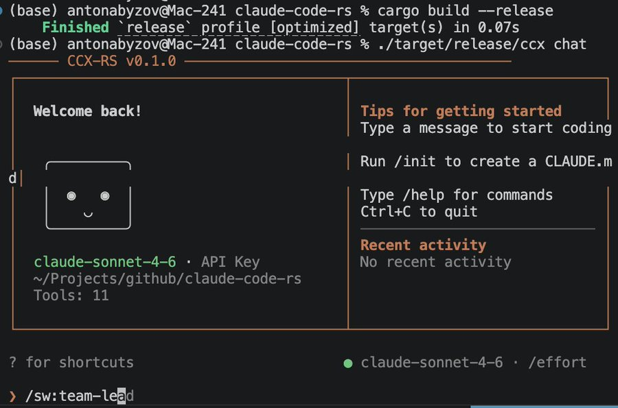

# CCX-RS — Community Claude Code eXtended

[](https://github.com/anton-abyzov/ccx-rs/releases)
[](LICENSE)
[]()

**The power of a 512K-line AI coding assistant in a 4.7MB binary.** Free, open-source, multi-model. Built from clean-room architecture analysis of the most advanced AI coding tool ever shipped. 19 tools, parallel execution, session persistence — works with Claude, DeepSeek, Nemotron, or any of 200+ models via OpenRouter. No subscription required.

> **CCX** = **C**ommunity **C**laude Code e**X**tended — the open-source, multi-model evolution of Claude Code. Built by the community, for the community.



## Install

### One-liner (recommended)

```bash
curl -fsSL https://raw.githubusercontent.com/anton-abyzov/ccx-rs/main/install.sh | sh
```

<details>
<summary>Other install methods</summary>

#### Cargo (from source)
```bash
cargo install --git https://github.com/anton-abyzov/ccx-rs ccx-cli
```

> **Don't have Rust?** Install it first: `curl --proto '=https' --tlsv1.2 -sSf https://sh.rustup.rs | sh`

#### Manual download
Download from [GitHub Releases](https://github.com/anton-abyzov/ccx-rs/releases) and add to your PATH.

#### Build from source
```bash
git clone https://github.com/anton-abyzov/ccx-rs.git
cd ccx-rs && cargo build --release
sudo cp target/release/ccx /usr/local/bin/
```

</details>

## Run

### Free (no subscription, no payment)
```bash
export OPENROUTER_API_KEY="your-free-key-from-openrouter.ai"
ccx chat --provider openrouter --model "nvidia/nemotron-3-super-120b-a12b:free"
```
Get a free key: [openrouter.ai/keys](https://openrouter.ai/keys)

### With reasoning (shows thinking process)
```bash
ccx chat --provider openrouter --model "deepseek/deepseek-r1"
```

### With Claude Max/Pro (auto-detects subscription)
```bash
ccx chat   # reads token from macOS Keychain — no API key needed
```

## Features

- **19 tools** — Bash, FileRead/Write/Edit, Glob, Grep, WebFetch, Agent (spawns sub-agents), TeamCreate, SendMessage, TaskCreate, and more
- **Claude Code-style TUI** — welcome panel, styled `>` prompt, inline tool display
- **Multi-model** — Claude (API/subscription), OpenRouter (200+ models), Ollama (local)
- **Tab autocomplete** — slash commands + 50+ discovered skills
- **MCP support** — connect external tool servers via `.mcp.json`
- **Session persistence** — `/resume`, `/continue`, `--resume`, `--continue`
- **Parallel tool execution** — all tools in a turn run concurrently
- **Thinking display** — see DeepSeek R1's reasoning in real-time
- **OAuth login** — `/login` opens browser, no API key copy-paste
- **Prompt caching** — saves tokens on multi-turn conversations

## Demo

```
$ ccx chat --provider openrouter --model "nvidia/nemotron-3-super-120b-a12b:free"

> Create a Python script that downloads the top 10 HN stories

* Bash(pip install requests)
  done
* Write(hn_top10.py)
  Created hn_top10.py (32 lines)
* Bash(python hn_top10.py)
  1. Show HN: CCX - Open source AI coding assistant
  2. Ask HN: Best free AI models for coding?
  ...
```

## Slash Commands

| Command | Description |
|---------|-------------|
| `/help` | Show all commands + discovered skills |
| `/tools` | List all 19 tools |
| `/login` | Authenticate via browser (OAuth) |
| `/cost` | Show token usage and cost |
| `/resume` | Resume a previous session |
| `/compact` | Compress conversation context |
| `/doctor` | Check health (API, tools, MCP) |

Plus 50+ discovered skills via Tab completion.

## Architecture

14-crate workspace:

| Crate | Purpose |
|-------|---------|
| `ccx-cli` | CLI entry point |
| `ccx-core` | Core agent loop |
| `ccx-api` | Anthropic API client with streaming |
| `ccx-auth` | API key + OAuth management |
| `ccx-tools` | Tool interface + 11 implementations |
| `ccx-permission` | Permission DSL and rules |
| `ccx-compact` | Context compression |
| `ccx-memory` | Memory persistence |
| `ccx-skill` | Skill loading and execution |
| `ccx-prompt` | System prompt builder |
| `ccx-config` | Settings and CLAUDE.md |
| `ccx-mcp` | MCP client |
| `ccx-tui` | Ratatui-based terminal UI |
| `ccx-sandbox` | OS-native sandboxing |

## License

MIT + Apache-2.0
